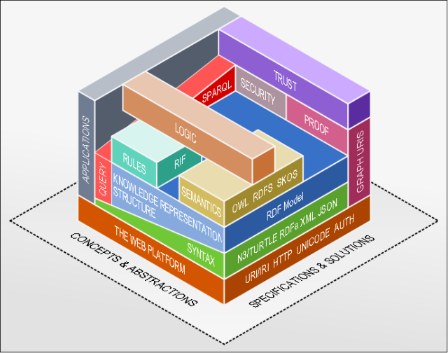

# Semantic Science: Publication Beyond the PDF

## An Example Scientific Article Written in Markdown

Tyler Thomas Procko

Department of Electrical Engineering and Computer Science

Embry-Riddle Aeronautical University

Daytona Beach, FL, USA

[prockot@my.erau.edu](prockot@my.erau.edu)

***Abstract*-The present article is an example pseudo-scientific paper written in Markdown. It contains all elements typically encountered in scientific articles: headed sections, figures, tables, lists, references, etc. The purpose here is to demonstrate the simplicity in writing scientific articles in Markdown for rapid dissemination as pre-prints, before seeking publication in traditional outlets.**

***Keywords*-scientific writing, markdown**

### I. Introduction
The present article is a demonstration of a minimal protocol proposed in a published paper, *Semantic Science: Publication Beyond the PDF*, presented at IEEE SoutheastCon 2024. It can be viewed in its Markdown source, Pandoc-converted HTML (annotated with RDFa using GPT-4), or Pandoc-converted PDF.

Because the present article is written in Markdown, one can embed links to citation sources as regular hyperlinks. Here is the proposal of Timothy Berners-Lee which started the World Wide Web [[1]](https://cds.cern.ch/record/369245/files/dd-89-001.pdf). While this citation is hosted as a PDF by CERN, many scientific articles are paywalled and inacessible. If all papers existed first as agnostic pre-prints (such as this one), explicit linking to all cited sources would be possible, allowing researchers to more quickly access content to integrate with their own work.

### II. Method
This article is written in Pandoc-style Markdown, so some more esoteric elements, such as insertions and highlights in MultiMarkdown, are not demonstrated.

#### a. Demonstration of Paper Elements
Writing paragraphs in Markdown is done normally. One can also *italicize* text and **bolden** text.

##### 1. Lists

Inserting lists, nested to arbitrary depth, is easy with Markdown:

* Semantic Web
* Linked Data
* FAIR Data
  * Ontologies
  * Knowledge Graphs
  * Provenance
    * Metadata
    * Etc.

The same can be done for numbered lists:

1. Aristotle
2. Niccolo Macchiavelli
3. Arthur Schopenhauer

##### 2. Tables

| Format | Inception |
|---|---|
| PDF | 1992 |
| DOCX | 2007 |
| TEX | 1984 |
| HTML | 1993 |
| MD | 2004 |

##### 3. Figures
Figures can be inserted by referencing them with respect to the Markdown file.



##### 4. Other

Math equations can also be inserted in Markdown, either inline or as a block, like below:
$$y = mx + b$$

Code blocks can be inserted:

```public static void main(String args[]){ }```

#### b. Formatting and Styling
xxx

### III. Conclusion
xxx

### References
[1] T. Berners-Lee, "Information Management: A Proposal," CERN, 1989. 